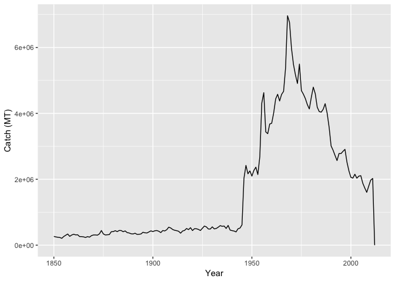
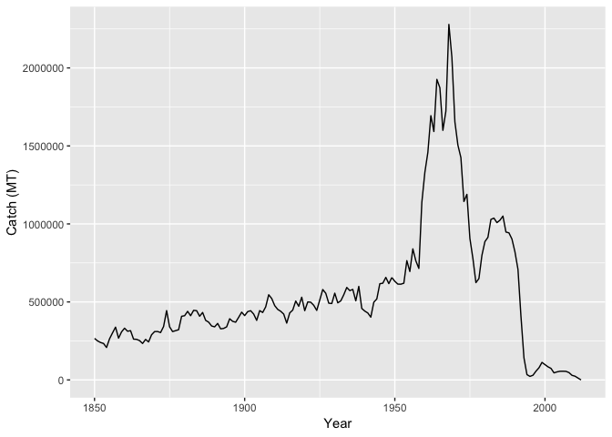
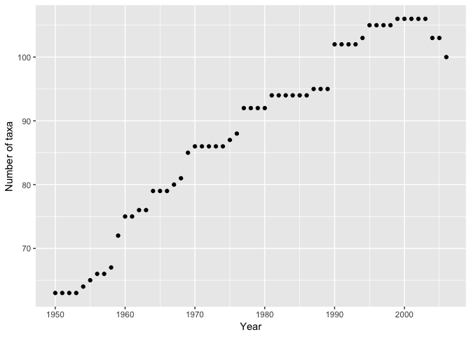
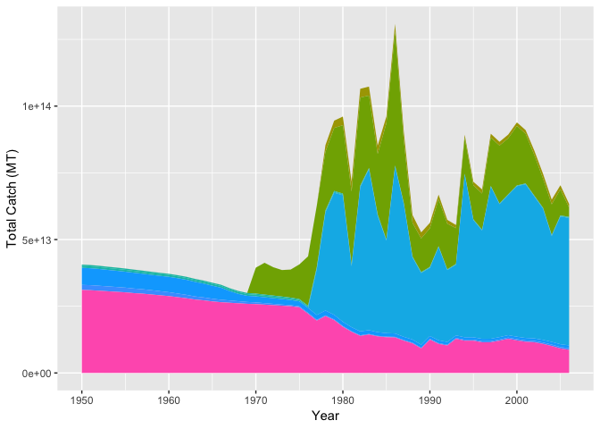

Fisheries Collapse
================
Megan Kan and Zack Dinh

The Database
------------

We used data from the [RAM Legacy Stock Assessment Database](http://ramlegacy.marinebiodiversity.ca/ram-legacy-stock-assessment-database)

First, we loaded in the necessary librarys.

``` r
#load libraries
library("tidyverse")
library("readxl")
```

Reading in the tables
---------------------

``` r
## old link not working today:
#download.file("https://depts.washington.edu/ramlegac/wordpress/databaseVersions/RLSADB_v3.0_(assessment_data_only)_excel.zip", 

# backup copy for class:
download.file("https://github.com/espm-157/fish-template/releases/download/data/ramlegacy.zip", 
              "ramlegacy.zip")
path <- unzip("ramlegacy.zip")  #unzip the .xls files
sheets <- readxl::excel_sheets(path) #use the readxl package to identify sheet names 
ram <- lapply(sheets, readxl::read_excel, path = path)  #read the data from all 3 sheets into a list
names(ram) <- sheets # give the list of datatables their assigned sheet names
```

``` r
## check your names
names(ram)
```

    ##  [1] "area"                    "assessment"             
    ##  [3] "assessmethod"            "assessor"               
    ##  [5] "biometrics"              "bioparams"              
    ##  [7] "bioparams_ids_views"     "bioparams_units_views"  
    ##  [9] "bioparams_values_views"  "management"             
    ## [11] "stock"                   "taxonomy"               
    ## [13] "timeseries"              "timeseries_ids_views"   
    ## [15] "timeseries_units_views"  "timeseries_values_views"
    ## [17] "tsmetrics"

``` r
#check your data, from ram file, taxomony tab, myersname column, filter for "COD"
ram$taxonomy %>% 
  filter(myersname == "COD")
```

    ## # A tibble: 1 x 15
    ##      tsn scientificname kingdom phylum classname ordername family genus
    ##    <dbl> <chr>          <chr>   <chr>  <chr>     <chr>     <chr>  <chr>
    ## 1 164712 Gadus morhua   Animal… Chord… Actinopt… Gadiform… Gadid… Gadus
    ## # ... with 7 more variables: species <chr>, myersname <chr>,
    ## #   commonname1 <chr>, commonname2 <chr>, myersscientificname <chr>,
    ## #   myersfamily <chr>, FisheryType <chr>

``` r
#ram file, timeseries tab
ram$timeseries
```

    ## # A tibble: 267,220 x 6
    ##    assessid         stockid   stocklong          tsid       tsyear tsvalue
    ##    <chr>            <chr>     <chr>              <chr>       <dbl>   <dbl>
    ##  1 NEFSC-ACADREDGO… ACADREDG… Acadian redfish G… BdivBmgtt…   1913    2.37
    ##  2 NEFSC-ACADREDGO… ACADREDG… Acadian redfish G… BdivBmgtt…   1914    2.37
    ##  3 NEFSC-ACADREDGO… ACADREDG… Acadian redfish G… BdivBmgtt…   1915    2.37
    ##  4 NEFSC-ACADREDGO… ACADREDG… Acadian redfish G… BdivBmgtt…   1916    2.37
    ##  5 NEFSC-ACADREDGO… ACADREDG… Acadian redfish G… BdivBmgtt…   1917    2.37
    ##  6 NEFSC-ACADREDGO… ACADREDG… Acadian redfish G… BdivBmgtt…   1918    2.37
    ##  7 NEFSC-ACADREDGO… ACADREDG… Acadian redfish G… BdivBmgtt…   1919    2.37
    ##  8 NEFSC-ACADREDGO… ACADREDG… Acadian redfish G… BdivBmgtt…   1920    2.37
    ##  9 NEFSC-ACADREDGO… ACADREDG… Acadian redfish G… BdivBmgtt…   1921    2.37
    ## 10 NEFSC-ACADREDGO… ACADREDG… Acadian redfish G… BdivBmgtt…   1922    2.37
    ## # ... with 267,210 more rows

``` r
#ram file, stock tab
ram$stock
```

    ## # A tibble: 513 x 9
    ##    stockid    tsn scientificname commonname areaid stocklong region
    ##    <chr>    <dbl> <chr>          <chr>      <chr>  <chr>     <chr> 
    ##  1 ACADRE… 166774 Sebastes fasc… Acadian r… USA-N… Acadian … US Ea…
    ##  2 AFLONCH 166156 Beryx splende… Alfonsino  multi… Alfonsin… South…
    ##  3 ALBAIO  172419 Thunnus alalu… albacore … multi… Albacore… India…
    ##  4 ALBAMED 172419 Thunnus alalu… albacore … multi… Albacore… Medit…
    ##  5 ALBANA… 172419 Thunnus alalu… Albacore … multi… Albacore… Atlan…
    ##  6 ALBANP… 172419 Thunnus alalu… Albacore … Multi… Albacore… US We…
    ##  7 ALBASA… 172419 Thunnus alalu… albacore … multi… Albacore… Atlan…
    ##  8 ALBASP… 172419 Thunnus alalu… Albacore … multi… Albacore… Pacif…
    ##  9 ALPLAI… 172901 Pleuronectes … Alaska pl… USA-N… Alaska p… US Al…
    ## 10 AMPL23K 172877 Hippoglossoid… American … Canad… American… Canad…
    ## # ... with 503 more rows, and 2 more variables: inmyersdb <dbl>,
    ## #   myersstockid <chr>

``` r
#filter stock by tsn number
ram$stock %>% 
  filter(tsn == 164712)
```

    ## # A tibble: 20 x 9
    ##    stockid    tsn scientificname commonname areaid stocklong region
    ##    <chr>    <dbl> <chr>          <chr>      <chr>  <chr>     <chr> 
    ##  1 COD2J3… 164712 Gadus morhua   Atlantic … Canad… Atlantic… Canad…
    ##  2 COD3M   164712 Gadus morhua   Atlantic … multi… Atlantic… Canad…
    ##  3 COD3NO  164712 Gadus morhua   Atlantic … multi… Atlantic… Canad…
    ##  4 COD3Pn… 164712 Gadus morhua   Atlantic … Canad… Atlantic… Canad…
    ##  5 COD3Ps  164712 Gadus morhua   Atlantic … Canad… Atlantic… Canad…
    ##  6 COD4TVn 164712 Gadus morhua   Atlantic … Canad… Atlantic… Canad…
    ##  7 COD4VsW 164712 Gadus morhua   Atlantic … Canad… Atlantic… Canad…
    ##  8 COD4X   164712 Gadus morhua   Atlantic … Canad… Atlantic… Canad…
    ##  9 CODBA2… 164712 Gadus morhua   Atlantic … multi… Atlantic… Europ…
    ## 10 CODBA2… 164712 Gadus morhua   Atlantic … multi… Atlantic… Europ…
    ## 11 CODFAPL 164712 Gadus morhua   Atlantic … multi… Atlantic… Europ…
    ## 12 CODGB   164712 Gadus morhua   Atlantic … USA-N… Atlantic… US Ea…
    ## 13 CODGOM  164712 Gadus morhua   Atlantic … USA-N… Atlantic… US Ea…
    ## 14 CODICE  164712 Gadus morhua   Atlantic … multi… Atlantic… Europ…
    ## 15 CODIS   164712 Gadus morhua   Atlantic … multi… Atlantic… Europ…
    ## 16 CODKAT  164712 Gadus morhua   Atlantic … multi… Atlantic… Europ…
    ## 17 CODNEAR 164712 Gadus morhua   Atlantic … multi… Atlantic… Europ…
    ## 18 CODNS   164712 Gadus morhua   Atlantic … multi… Atlantic… Europ…
    ## 19 CODVIa  164712 Gadus morhua   Atlantic … multi… Atlantic… Europ…
    ## 20 CODVII… 164712 Gadus morhua   Atlantic … multi… Atlantic… Europ…
    ## # ... with 2 more variables: inmyersdb <dbl>, myersstockid <chr>

``` r
#cod_tsn = extract first tsn number for genus "Gadus"
cod_tsn <-
  ram$taxonomy %>% 
  filter(genus == "Gadus") %>%
  pull(tsn)
cod_tsn[1]
```

    ## [1] 164711

``` r
#filter stock by tsn number
ram$stock %>% 
  filter(tsn %in% cod_tsn)
```

    ## # A tibble: 24 x 9
    ##    stockid    tsn scientificname commonname areaid stocklong region
    ##    <chr>    <dbl> <chr>          <chr>      <chr>  <chr>     <chr> 
    ##  1 COD2J3… 164712 Gadus morhua   Atlantic … Canad… Atlantic… Canad…
    ##  2 COD3M   164712 Gadus morhua   Atlantic … multi… Atlantic… Canad…
    ##  3 COD3NO  164712 Gadus morhua   Atlantic … multi… Atlantic… Canad…
    ##  4 COD3Pn… 164712 Gadus morhua   Atlantic … Canad… Atlantic… Canad…
    ##  5 COD3Ps  164712 Gadus morhua   Atlantic … Canad… Atlantic… Canad…
    ##  6 COD4TVn 164712 Gadus morhua   Atlantic … Canad… Atlantic… Canad…
    ##  7 COD4VsW 164712 Gadus morhua   Atlantic … Canad… Atlantic… Canad…
    ##  8 COD4X   164712 Gadus morhua   Atlantic … Canad… Atlantic… Canad…
    ##  9 CODBA2… 164712 Gadus morhua   Atlantic … multi… Atlantic… Europ…
    ## 10 CODBA2… 164712 Gadus morhua   Atlantic … multi… Atlantic… Europ…
    ## # ... with 14 more rows, and 2 more variables: inmyersdb <dbl>,
    ## #   myersstockid <chr>

``` r
#for tsn join ram$area to ram$stock
ram$taxonomy %>%
  filter(genus == "Gadus") %>%
  select(tsn) %>%
  left_join(ram$stock) %>%
  left_join(ram$area)
```

    ## # A tibble: 24 x 14
    ##       tsn stockid scientificname commonname areaid stocklong region
    ##     <dbl> <chr>   <chr>          <chr>      <chr>  <chr>     <chr> 
    ##  1 164711 PCODBS… Gadus macroce… Pacific c… USA-N… Pacific … US Al…
    ##  2 164711 PCODGA  Gadus macroce… Pacific c… USA-N… Pacific … US Al…
    ##  3 164711 PCODHS  Gadus macroce… Pacific c… Canad… Pacific … Canad…
    ##  4 164711 PCODWC… Gadus macroce… Pacific c… Canad… Pacific … Canad…
    ##  5 164712 COD2J3… Gadus morhua   Atlantic … Canad… Atlantic… Canad…
    ##  6 164712 COD3M   Gadus morhua   Atlantic … multi… Atlantic… Canad…
    ##  7 164712 COD3NO  Gadus morhua   Atlantic … multi… Atlantic… Canad…
    ##  8 164712 COD3Pn… Gadus morhua   Atlantic … Canad… Atlantic… Canad…
    ##  9 164712 COD3Ps  Gadus morhua   Atlantic … Canad… Atlantic… Canad…
    ## 10 164712 COD4TVn Gadus morhua   Atlantic … Canad… Atlantic… Canad…
    ## # ... with 14 more rows, and 7 more variables: inmyersdb <dbl>,
    ## #   myersstockid <chr>, country <chr>, areatype <chr>, areacode <chr>,
    ## #   areaname <chr>, alternateareaname <chr>

``` r
ram$stock %>% 
  group_by(tsn) %>% summarise(count = n()) %>%
  arrange(desc(count))
```

    ## # A tibble: 244 x 2
    ##       tsn count
    ##     <dbl> <int>
    ##  1 164712    20
    ##  2 161722    18
    ##  3 164744    11
    ##  4 660225     9
    ##  5 165000     8
    ##  6 551209     8
    ##  7 164722     7
    ##  8 173001     7
    ##  9  98428     6
    ## 10 161813     6
    ## # ... with 234 more rows

``` r
#172419
```

``` r
cod <- ram$taxonomy %>%
  left_join(ram$stock, by = "tsn") %>%
  left_join(ram$area, by = "areaid") %>%
  left_join(ram$timeseries, by = "stockid") %>% 
  left_join(ram$tsmetrics, by = c("tsid" = "tsunique")) %>%
  
  group_by(tsid) %>%
  
  filter(genus == "Gadus", species == "morhua") %>%
  filter(tscategory == "CATCH or LANDINGS") %>%
  filter(tsunitsshort == "MT") %>%

  arrange(desc(tsyear)) 
  #select(tsn)
  #select(tsyear, tsvalue, country, region, commonname, stockid, tsn, areaid)
cod
```

    ## # A tibble: 2,389 x 38
    ## # Groups:   tsid [3]
    ##       tsn scientificname.x kingdom phylum classname ordername family genus
    ##     <dbl> <chr>            <chr>   <chr>  <chr>     <chr>     <chr>  <chr>
    ##  1 164712 Gadus morhua     Animal… Chord… Actinopt… Gadiform… Gadid… Gadus
    ##  2 164712 Gadus morhua     Animal… Chord… Actinopt… Gadiform… Gadid… Gadus
    ##  3 164712 Gadus morhua     Animal… Chord… Actinopt… Gadiform… Gadid… Gadus
    ##  4 164712 Gadus morhua     Animal… Chord… Actinopt… Gadiform… Gadid… Gadus
    ##  5 164712 Gadus morhua     Animal… Chord… Actinopt… Gadiform… Gadid… Gadus
    ##  6 164712 Gadus morhua     Animal… Chord… Actinopt… Gadiform… Gadid… Gadus
    ##  7 164712 Gadus morhua     Animal… Chord… Actinopt… Gadiform… Gadid… Gadus
    ##  8 164712 Gadus morhua     Animal… Chord… Actinopt… Gadiform… Gadid… Gadus
    ##  9 164712 Gadus morhua     Animal… Chord… Actinopt… Gadiform… Gadid… Gadus
    ## 10 164712 Gadus morhua     Animal… Chord… Actinopt… Gadiform… Gadid… Gadus
    ## # ... with 2,379 more rows, and 30 more variables: species <chr>,
    ## #   myersname <chr>, commonname1 <chr>, commonname2 <chr>,
    ## #   myersscientificname <chr>, myersfamily <chr>, FisheryType <chr>,
    ## #   stockid <chr>, scientificname.y <chr>, commonname <chr>, areaid <chr>,
    ## #   stocklong.x <chr>, region <chr>, inmyersdb <dbl>, myersstockid <chr>,
    ## #   country <chr>, areatype <chr>, areacode <chr>, areaname <chr>,
    ## #   alternateareaname <chr>, assessid <chr>, stocklong.y <chr>,
    ## #   tsid <chr>, tsyear <dbl>, tsvalue <dbl>, tscategory <chr>,
    ## #   tsshort <chr>, tslong <chr>, tsunitsshort <chr>, tsunitslong <chr>

Investigating the North-Atlantic Cod
====================================

First, We seek to replicate the following figure from the Millenium Ecosystem Assessment Project using the RAM data.


Cod by area:

``` r
cod %>%
    select(areaname, areacode, areaid, region, country) %>%
  distinct() 
```

    ## # A tibble: 44 x 6
    ## # Groups:   tsid [3]
    ##    tsid    areaname           areacode areaid         region     country  
    ##    <chr>   <chr>              <chr>    <chr>          <chr>      <chr>    
    ##  1 Ctouse… Flemish Cap        3M       multinational… Canada Ea… multinat…
    ##  2 TC-MT   Flemish Cap        3M       multinational… Canada Ea… multinat…
    ##  3 Ctouse… Northern Gulf of … 3Pn4RS   Canada-DFO-3P… Canada Ea… Canada   
    ##  4 TL-MT   Northern Gulf of … 3Pn4RS   Canada-DFO-3P… Canada Ea… Canada   
    ##  5 Ctouse… Western Baltic     22-24    multinational… European … multinat…
    ##  6 TL-MT   Western Baltic     22-24    multinational… European … multinat…
    ##  7 Ctouse… Eastern Baltic     25-32    multinational… European … multinat…
    ##  8 TL-MT   Eastern Baltic     25-32    multinational… European … multinat…
    ##  9 Ctouse… Faroe Plateau      Vb1      multinational… Europe no… multinat…
    ## 10 TL-MT   Faroe Plateau      Vb1      multinational… Europe no… multinat…
    ## # ... with 34 more rows

Mapping the data from just the areas where Atlantic Cod are found:

``` r
cod %>%
  select(areaname, areacode, areaid, region, country) %>%
  distinct() %>%
  filter(country == c("Canada", "USA", "Mexico"))
```

    ## Warning in country == c("Canada", "USA", "Mexico"): longer object length is
    ## not a multiple of shorter object length

    ## Warning in country == c("Canada", "USA", "Mexico"): longer object length is
    ## not a multiple of shorter object length

    ## Warning in country == c("Canada", "USA", "Mexico"): longer object length is
    ## not a multiple of shorter object length

    ## # A tibble: 8 x 6
    ## # Groups:   tsid [3]
    ##   tsid    areaname                areacode areaid      region      country
    ##   <chr>   <chr>                   <chr>    <chr>       <chr>       <chr>  
    ## 1 TL-MT   Northern Gulf of St. L… 3Pn4RS   Canada-DFO… Canada Eas… Canada 
    ## 2 Ctouse… Southern Labrador-East… 2J3KL    Canada-DFO… Canada Eas… Canada 
    ## 3 TC-MT   Southern Labrador-East… 2J3KL    Canada-DFO… Canada Eas… Canada 
    ## 4 Ctouse… Southern Gulf of St. L… 4T       Canada-DFO… Canada Eas… Canada 
    ## 5 TL-MT   Southern Gulf of St. L… 4T       Canada-DFO… Canada Eas… Canada 
    ## 6 Ctouse… Georges Bank            5Z       USA-NMFS-5Z US East Co… USA    
    ## 7 Ctouse… Western Scotian Shelf   4X       Canada-DFO… Canada Eas… Canada 
    ## 8 TC-MT   Western Scotian Shelf   4X       Canada-DFO… Canada Eas… Canada

Subsetting our data by regional id
----------------------------------

Vector of ids in Canada:

``` r
cod %>%
  select(areaname, areacode, areaid, region, country) %>%
  distinct() %>%
  filter(country == "Canada")
```

    ## # A tibble: 12 x 6
    ## # Groups:   tsid [3]
    ##    tsid    areaname               areacode areaid      region      country
    ##    <chr>   <chr>                  <chr>    <chr>       <chr>       <chr>  
    ##  1 Ctouse… Northern Gulf of St. … 3Pn4RS   Canada-DFO… Canada Eas… Canada 
    ##  2 TL-MT   Northern Gulf of St. … 3Pn4RS   Canada-DFO… Canada Eas… Canada 
    ##  3 Ctouse… Southern Labrador-Eas… 2J3KL    Canada-DFO… Canada Eas… Canada 
    ##  4 TC-MT   Southern Labrador-Eas… 2J3KL    Canada-DFO… Canada Eas… Canada 
    ##  5 Ctouse… St. Pierre Bank        3Ps      Canada-DFO… Canada Eas… Canada 
    ##  6 TL-MT   St. Pierre Bank        3Ps      Canada-DFO… Canada Eas… Canada 
    ##  7 Ctouse… Southern Gulf of St. … 4T       Canada-DFO… Canada Eas… Canada 
    ##  8 TL-MT   Southern Gulf of St. … 4T       Canada-DFO… Canada Eas… Canada 
    ##  9 Ctouse… Western Scotian Shelf  4X       Canada-DFO… Canada Eas… Canada 
    ## 10 TC-MT   Western Scotian Shelf  4X       Canada-DFO… Canada Eas… Canada 
    ## 11 Ctouse… Eastern Scotian Shelf  4VsW     Canada-DFO… Canada Eas… Canada 
    ## 12 TC-MT   Eastern Scotian Shelf  4VsW     Canada-DFO… Canada Eas… Canada

Total catch of cod:
===================

``` r
cod %>%
  group_by(tsyear) %>% 
  summarise(catch_tons = sum(tsvalue, na.rm = TRUE)) %>%
  ggplot(aes(tsyear, catch_tons)) + geom_line() + labs( x = "Year", y = "Catch (MT)")
```



Total Catch in Canada
---------------------

Calculate and plot the catch in million tons (MT) of Atlantic Cod from Canada using the data table and vector of ids you created above. Hint: you may want to use functions like `group_by()`, `filter()`, and/or `summarise()`

``` r
cod %>%
  filter(country == "Canada") %>%
  group_by(tsyear) %>% 
  summarise(catch_tons = sum(tsvalue, na.rm = TRUE)) %>%
  ggplot(aes(tsyear, catch_tons)) + geom_line() + labs( x = "Year", y = "Catch (MT)")
```



Comparing the catches of Canadian Atlantic Cod to global catches of Atlantic Cod, we see a collapse starting 1992 for Canada, but global stocks are not depleted until around 2015.

------------------------------------------------------------------------

Stock Collapses
---------------

We seek to replicate the temporal trend in stock declines shown in [Worm et al 2006](http://doi.org/10.1126/science.1132294):


This plot includes years 1950-2005 and the percentage of collapsed taxa.

Plotting total taxa caught worldwide 1950-2006
----------------------------------------------

Total taxa and corresponding information:

``` r
global <- ram$taxonomy %>%
  left_join(ram$stock, by = "tsn") %>%
  left_join(ram$area, by = "areaid") %>%
  left_join(ram$timeseries, by = "stockid") %>% 
  left_join(ram$tsmetrics, by = c("tsid" = "tsunique")) 
global
```

    ## # A tibble: 267,223 x 38
    ##      tsn scientificname.x kingdom phylum classname ordername family genus
    ##    <dbl> <chr>            <chr>   <chr>  <chr>     <chr>     <chr>  <chr>
    ##  1  -999 Pseudocarcinus … Animal… Arthr… Malacost… Decapoda  Menip… Pseu…
    ##  2  -999 Pseudocarcinus … Animal… Arthr… Malacost… Decapoda  Menip… Pseu…
    ##  3  -999 Pseudocarcinus … Animal… Arthr… Malacost… Decapoda  Menip… Pseu…
    ##  4  -999 Pseudocarcinus … Animal… Arthr… Malacost… Decapoda  Menip… Pseu…
    ##  5  -999 Pseudocarcinus … Animal… Arthr… Malacost… Decapoda  Menip… Pseu…
    ##  6  -999 Pseudocarcinus … Animal… Arthr… Malacost… Decapoda  Menip… Pseu…
    ##  7  -999 Pseudocarcinus … Animal… Arthr… Malacost… Decapoda  Menip… Pseu…
    ##  8  -999 Pseudocarcinus … Animal… Arthr… Malacost… Decapoda  Menip… Pseu…
    ##  9  -999 Pseudocarcinus … Animal… Arthr… Malacost… Decapoda  Menip… Pseu…
    ## 10  -999 Pseudocarcinus … Animal… Arthr… Malacost… Decapoda  Menip… Pseu…
    ## # ... with 267,213 more rows, and 30 more variables: species <chr>,
    ## #   myersname <chr>, commonname1 <chr>, commonname2 <chr>,
    ## #   myersscientificname <chr>, myersfamily <chr>, FisheryType <chr>,
    ## #   stockid <chr>, scientificname.y <chr>, commonname <chr>, areaid <chr>,
    ## #   stocklong.x <chr>, region <chr>, inmyersdb <dbl>, myersstockid <chr>,
    ## #   country <chr>, areatype <chr>, areacode <chr>, areaname <chr>,
    ## #   alternateareaname <chr>, assessid <chr>, stocklong.y <chr>,
    ## #   tsid <chr>, tsyear <dbl>, tsvalue <dbl>, tscategory <chr>,
    ## #   tsshort <chr>, tslong <chr>, tsunitsshort <chr>, tsunitslong <chr>

Total taxa for each year from 1950-2006:

``` r
taxa_year <- global %>%
select(tsyear, scientificname.x, stockid, tsid, tsvalue) %>%
  filter(tsyear >= 1950, tsyear <= 2006) %>%
  group_by(tsyear) %>%
  summarise(n = n_distinct(tsid))
taxa_year
```

    ## # A tibble: 57 x 2
    ##    tsyear     n
    ##     <dbl> <int>
    ##  1   1950    63
    ##  2   1951    63
    ##  3   1952    63
    ##  4   1953    63
    ##  5   1954    64
    ##  6   1955    65
    ##  7   1956    66
    ##  8   1957    66
    ##  9   1958    67
    ## 10   1959    72
    ## # ... with 47 more rows

``` r
ggplot(taxa_year, aes(x = tsyear, y = n)) + geom_point() + labs( x = "Year", y = "Number of taxa")
```



Removing incomplete datasets
----------------------------

Filtering out NA's in data set including data from 1950-2006:

``` r
taxa_clean <- global %>%
  filter(tsyear >= 1950, tsyear <= 2006) %>%
  select(tsyear, scientificname.x, stockid, tsvalue) %>%
  group_by(scientificname.x) %>%
  filter(!is.na(tsvalue)) 
taxa_clean
```

    ## # A tibble: 200,258 x 4
    ## # Groups:   scientificname.x [242]
    ##    tsyear scientificname.x     stockid         tsvalue
    ##     <dbl> <chr>                <chr>             <dbl>
    ##  1   1990 Pseudocarcinus gigas TASGIANTCRABTAS    1470
    ##  2   1991 Pseudocarcinus gigas TASGIANTCRABTAS    1710
    ##  3   1992 Pseudocarcinus gigas TASGIANTCRABTAS    1790
    ##  4   1993 Pseudocarcinus gigas TASGIANTCRABTAS    2000
    ##  5   1994 Pseudocarcinus gigas TASGIANTCRABTAS    1930
    ##  6   1995 Pseudocarcinus gigas TASGIANTCRABTAS    1680
    ##  7   1996 Pseudocarcinus gigas TASGIANTCRABTAS    1360
    ##  8   1997 Pseudocarcinus gigas TASGIANTCRABTAS    1130
    ##  9   1998 Pseudocarcinus gigas TASGIANTCRABTAS     969
    ## 10   1999 Pseudocarcinus gigas TASGIANTCRABTAS     846
    ## # ... with 200,248 more rows

Stockids that have data for the full range (1950-2006):

``` r
taxa_full <- taxa_clean %>%
  
  #number of years available per taxa
  group_by(tsyear, stockid) %>%
  summarise(total_value = sum(tsvalue)) %>%
  ungroup()  %>%
  group_by(stockid) %>%
  count() %>%
  
  #stockid with years from 1950-2006 = 94, 94 x 57 years = 5,130 total rows
  filter(n == 57) %>%

  
  #stockid with years from 1950-2006 joined to taxa_clean for tsvalue ()
  inner_join(taxa_clean) %>%
  filter(!is.na(n)) %>%
  group_by(tsyear, stockid) %>%
  summarise(total_value = sum(tsvalue)) 
  

taxa_full  
```

    ## # A tibble: 5,130 x 3
    ## # Groups:   tsyear [?]
    ##    tsyear stockid        total_value
    ##     <dbl> <chr>                <dbl>
    ##  1   1950 ACADREDGOMGB     41963021.
    ##  2   1950 ALBAIO           12191518.
    ##  3   1950 ALBANATL           576423.
    ##  4   1950 ARFLOUNDPCOAST   28742717.
    ##  5   1950 ATBTUNAEATL       3827528.
    ##  6   1950 ATBTUNAWATL          2017 
    ##  7   1950 ATHAL5YZ             2335.
    ##  8   1950 BGROCKPCOAST      3488862.
    ##  9   1950 BHEADSHARATL     24913859.
    ## 10   1950 BIGEYEATL         1717186.
    ## # ... with 5,120 more rows

90 taxa based on stockid have data for the full 1950-2006 range.

Collapsed fisheries
-------------------

Table including `stockid`, `TC`, `year`, `collapsed`, and `cumulative`, where `collapsed` is a logical (True or False) for whether or not that fishery could be considered collapsed in that year, and `cumulative` is the count of total years the fishery has been collapsed at that point in time. A fishery is considered collapsed when total catch (TC) falls below 10% of its peak.

``` r
taxa_peak <- taxa_full %>%
  
  #catch peak per taxa
  group_by(stockid) %>%
  summarise(peak = max(total_value)) %>%

  
  right_join(taxa_full) %>%
  select(stockid, tsyear, total_value, peak) %>%
  rename(year = tsyear, TC = total_value) %>%

  mutate(collapsevalue = peak - (peak * .1)) %>%

  #filter(year == 2006) %>%

  mutate(collapsed = TC < collapsevalue) %>%
  group_by(stockid) %>%
  mutate(cumulative = cumsum(collapsed))
 
taxa_peak
```

    ## # A tibble: 5,130 x 7
    ## # Groups:   stockid [90]
    ##    stockid       year       TC     peak collapsevalue collapsed cumulative
    ##    <chr>        <dbl>    <dbl>    <dbl>         <dbl> <lgl>          <int>
    ##  1 ACADREDGOMGB  1950   4.20e7   1.96e8    176098918. TRUE               1
    ##  2 ALBAIO        1950   1.22e7   1.22e7     10974783. FALSE              0
    ##  3 ALBANATL      1950   5.76e5   5.89e5       530084. FALSE              0
    ##  4 ARFLOUNDPCO…  1950   2.87e7   1.27e8    114251520. TRUE               1
    ##  5 ATBTUNAEATL   1950   3.83e6   6.94e6      6247878. TRUE               1
    ##  6 ATBTUNAWATL   1950   2.02e3   6.50e5       585264. TRUE               1
    ##  7 ATHAL5YZ      1950   2.33e3   4.35e3         3918. TRUE               1
    ##  8 BGROCKPCOAST  1950   3.49e6   3.49e6      3139976. FALSE              0
    ##  9 BHEADSHARATL  1950   2.49e7   2.49e7     22422473. FALSE              0
    ## 10 BIGEYEATL     1950   1.72e6   1.72e6      1547185. FALSE              0
    ## # ... with 5,120 more rows

Cumulative years collapsed:

``` r
taxa_peak %>%
  summarise(years_collapsed = max(cumulative)) 
```

    ## # A tibble: 90 x 2
    ##    stockid        years_collapsed
    ##    <chr>                    <dbl>
    ##  1 ACADREDGOMGB                55
    ##  2 ALBAIO                      15
    ##  3 ALBANATL                    54
    ##  4 ARFLOUNDPCOAST              56
    ##  5 ATBTUNAEATL                 55
    ##  6 ATBTUNAWATL                 56
    ##  7 ATHAL5YZ                    54
    ##  8 BGROCKPCOAST                32
    ##  9 BHEADSHARATL                46
    ## 10 BIGEYEATL                   30
    ## # ... with 80 more rows

Plotting total catch
--------------------

``` r
taxa_peak %>%
  ggplot(aes(x = year, y = TC, fill = stockid)) + geom_area() + 
    theme(legend.position = "none") + 
    labs( x = "Year", y = "Total Catch (MT)")
```


