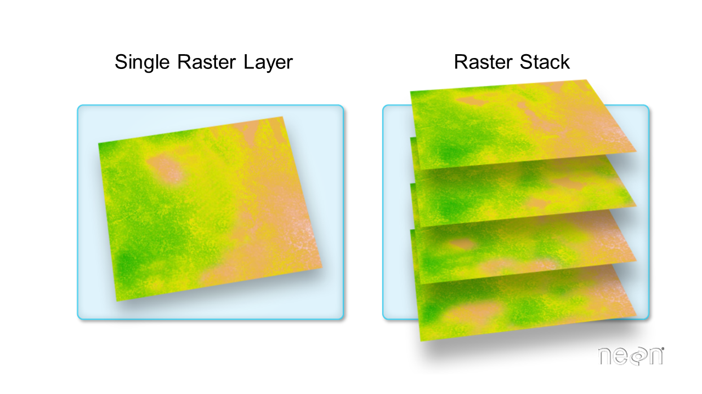

Spatial Assignment - Habitat Suitability Analysis for the Pacific Spiny Lumpsucker
================
Erik J Ortega & Zack Dinh

Exercise
========

This module is inspired by a recent paper in Nature Ecology and Evolution, [**Mapping the global potential for marine aquaculture**](https://www.nature.com/articles/s41559-017-0257-9). The authors used multiple constraints including ship traffic, dissolved oxygen, bottom depth and more, to limit and map areas suitable for aquaculture.


We are going to use a similar, but much more simplified approach here. We will map potential areas of marine aquaculture for the super cute Pacific spiny lumpsucker (*Eumicrotremus orbis*)


To do this we are going to need the following spatial data:

**1. Sea Surface Temperature** (raster data)
**2. Net Primary Productivity** (raster data)
**3. Marine Protected Areas** (vector data)

Exercise 1: Play with Vector Data
---------------------------------

So to figure out where we might find the lumpsucker fish, we need to know a little about it!

From [NOAA's species description](http://www.nmfs.noaa.gov/speciesid/fish_page/fish68a.html):

> A lot of people who see Pacific spiny lumpsuckers for the first time describe them as a ping-pong ball with fins. They are tiny and very inefficient swimmers, found most often in kelp or eelgrass beds attached to a rock or a log no deeper than 500 feet. They are quite common, ranging from the waters off the Washington coast, up around the arc of the Aleutian Islands, to the Asian mainland and the northern islands of Japan, and in the Bering Sea. A giant Pacific spiny lumpsucker is five inches long, but most are closer to an inch. Scuba divers are their biggest fans because the little fellows will eat right out of their hands.

Key information for optimal growth:

-   Sea surface temperatures between **12 and 18 degrees Celsius**
-   Net Primary Productivity between **2.6 and 3 mgC/m2/day**

### Task 1: Load and Visualize data

We'll start with a data file of Marine Protected Areas monitored by the US Federal government on the west coast: `mpas_westcoast.shp`. This is found in your `shapefiles` directory. Load this in using the `st_read` function.

``` r
#load west coast marine protected areas shapefile 
mpas <- st_read("shapefiles/mpas_westcoast.shp")
```

    ## Reading layer `mpas_westcoast' from data source `C:\Users\Zack\Desktop\2018-spatial-spatial_erik_zack\spatial\shapefiles\mpas_westcoast.shp' using driver `ESRI Shapefile'
    ## Simple feature collection with 348 features and 25 fields
    ## geometry type:  MULTIPOLYGON
    ## dimension:      XY
    ## bbox:           xmin: -2707616 ymin: -457193.8 xmax: -1950642 ymax: 1553906
    ## epsg (SRID):    NA
    ## proj4string:    +proj=aea +lat_1=29.5 +lat_2=45.5 +lat_0=37.5 +lon_0=-96 +x_0=0 +y_0=0 +datum=NAD83 +units=m +no_defs

``` r
#use heaad(mpas) to inspect
#head(mpas)
```

### Map of West Coast Marine Protected Areas

``` r
#plot west coast marine protected areas shapefile
plot(mpas["State"], main = "West Coast MPAs by State", pal = sf.colors(10, categorical = TRUE), border = 'white', 
     axes = FALSE, key.pos = 4, key.width = lcm(10), graticule = TRUE)
```


``` r
#ggplot method
#mpas %>% ggplot() + geom_sf(aes(col = State))
```

### Task 3

How much protected marine habitat does each state or agency control? The National Marine Fisheries Service contorls the largest amount of marine habitat (387,058.3 square kilometers). The table below, in descening order states total area for each entity.

``` r
mpas %>%
    select(State, Area_KM_To) %>%
    group_by(State) %>%
    summarise(TotalArea = sum(Area_KM_To)) %>%
    arrange(desc(TotalArea)) 
```

    ## Simple feature collection with 10 features and 2 fields
    ## geometry type:  GEOMETRY
    ## dimension:      XY
    ## bbox:           xmin: -2707616 ymin: -457193.8 xmax: -1950642 ymax: 1553906
    ## epsg (SRID):    NA
    ## proj4string:    +proj=aea +lat_1=29.5 +lat_2=45.5 +lat_0=37.5 +lon_0=-96 +x_0=0 +y_0=0 +datum=NAD83 +units=m +no_defs
    ## # A tibble: 10 x 3
    ##    State               TotalArea                                  geometry
    ##    <fct>                   <dbl>                            <GEOMETRY [m]>
    ##  1 National Marine Fi~ 387058.   MULTIPOLYGON (((-2022333 -317282.9, -202~
    ##  2 National Marine Sa~  32591.   MULTIPOLYGON (((-2093543 -191307.6, -209~
    ##  3 National Park Serv~   5851.   MULTIPOLYGON (((-2103158 -191604.2, -210~
    ##  4 California            4620.   MULTIPOLYGON (((-1957131 -333326.9, -195~
    ##  5 Washington            2218.   MULTIPOLYGON (((-2114207 1331625, -21141~
    ##  6 National Wildlife ~    619.   MULTIPOLYGON (((-1956125 -332742.8, -195~
    ##  7 Bureau of Ocean En~    224.   POLYGON ((-2131762 -84901.34, -2131745 -~
    ##  8 National Estuarine~    103.   MULTIPOLYGON (((-1956380 -332373.5, -195~
    ##  9 Oregon                  27.7  MULTIPOLYGON (((-2291710 852562.4, -2291~
    ## 10 Marine National Mo~      7.72 MULTIPOLYGON (((-1964285 -319058.9, -196~

Exercise 2: Load and Play with Raster data
------------------------------------------

**Sea Surface Temperature**

In the `rasters` folder, there are 5 `.tif` files with the naming pattern `average_annual_sst_[year].tif`, which are 5 annual average sea surface temperatures for our region (2008-2012). We want just **one** raster file of the average SST over that time period.

### Task 1: Read in raster data

To create a single average Sea Surface Temperature layer, you'll first need to read in all 5 data files (try adapting the `list.files()` function). To read them all in, you'll use the `raster` function. This is a good place to try the `map` function too!

``` r
files <- list.files("rasters/", pattern = "average", full.names = TRUE)
```

``` r
rasterstack <- stack(files)
plot(rasterstack)
```


### Task 2: Visualize & Explore

*Notice the data values are in Kelvin - we will change this to celsius later.*

Try exploring the data, using basic functions like `hist()`, or `summary()`

``` r
summary(rasterstack)
```

    ## Warning in .local(object, ...): summary is an estimate based on a sample of 1e+05 cells (51.06% of all cells)

    ##         average_annual_sst_2008 average_annual_sst_2009
    ## Min.                   278.7000                278.0800
    ## 1st Qu.                285.2526                285.6945
    ## Median                 287.1172                287.7019
    ## 3rd Qu.                289.1167                289.7083
    ## Max.                   301.2700                301.5000
    ## NA's                 81869.0000              81992.0000
    ##         average_annual_sst_2010 average_annual_sst_2011
    ## Min.                   279.9200                279.5000
    ## 1st Qu.                285.6521                285.4800
    ## Median                 287.3965                286.9784
    ## 3rd Qu.                289.3566                288.7772
    ## Max.                   299.9800                307.2733
    ## NA's                 82088.0000              81749.0000
    ##         average_annual_sst_2012
    ## Min.                   278.1300
    ## 1st Qu.                285.5408
    ## Median                 286.9897
    ## 3rd Qu.                289.0179
    ## Max.                   307.1300
    ## NA's                 81640.0000

#### Question: What year had the highest annual sea surface temperature recorded?

The highest annual sea surface temperature was in 2011 with a max of 307.2733 K.

### Task 4: Stack rasters

To get a single layer of average SST in degrees Celsius we need to first `stack` all layers.



`stack` is a function from the raster package that puts all RasterLayers into a RasterStack. It can stack either from filenames for rasters, or from the raster objects themselves. Produce a rasterstack of Average Sea Surface Temperature across all 5 years. Try using the `plot` function to visualize the stack.

### Task 5: Raster calcuations

We want to take this stack of 5 rasters and make one. Additionally for easier interpretation, we want our averaged raster in Celsius. The conversion between Kelvin and Celsius is: *C* = *K* − 273.15

This collapse and conversion could be done in multiple steps, but since we like to emphasize concision in our coding, let's instead write a small custom function to take the mean and convert to Celsius. We will then apply this function to our rasterstack to calculate a new raster we can use for analysis.

Write your custom R function.

``` r
converter <- function(rasterdata) {
  calc(rasterdata, fun = mean) - 273.15
}

combined_sst <- converter(rasterstack)

plot(combined_sst, main = "Combined Sea Surface Temperature (2008-2012)")
```


Exercise 3: Projections
-----------------------

Since Lumpsuckers may be influenced by more than just sea surface temperature, we want to include **Net Primary Production (NPP)** in our analysis. So we need to read that in too and create a rasterstack of ur new `sst_avg` raster and the NPP layer.

#### Task 1: Read in NPP raster data

Read in the NPP data, using the `raster()` command and the "annual\_npp.tif" found in the rasters folder. This data is the net primary production (mgC/m2/day). After reading it in, plot this data.

``` r
npp <- raster("rasters/annual_npp.tif")
plot(npp, main = "Net Primary Produciton")
```


### Task 2: Reproject

Try adding these two layers together using `stack` and you'll get an error because these rasters are not in the same "projection" - pretty obvious from the plots. In order to do analysis across multiple spatial datasources, they must be using the same coordinate reference system.

Use the `crs()` command to see what coordinate system each of your rasters are using and, for good measure, use the `st_crs` command to investigate the crs of our vector data, `west_coast`, from above:

``` r
#stack will error
#stack(combined_sst, npp)
```

``` r
crs(combined_sst)
```

    ## CRS arguments: +proj=longlat +ellps=WGS84 +no_defs

``` r
crs(npp)
```

    ## CRS arguments:
    ##  +proj=aea +lat_1=29.5 +lat_2=45.5 +lat_0=37.5 +lon_0=-96 +x_0=0
    ## +y_0=0 +ellps=GRS80 +towgs84=0,0,0,0,0,0,0 +units=m +no_defs

``` r
st_crs(mpas)
```

    ## Coordinate Reference System:
    ##   No EPSG code
    ##   proj4string: "+proj=aea +lat_1=29.5 +lat_2=45.5 +lat_0=37.5 +lon_0=-96 +x_0=0 +y_0=0 +datum=NAD83 +units=m +no_defs"

Looks like `npp` is equal to our `west_coast` but our mean SST layer is different! It's crucial when doing spatial analysis that your projections across all layers are equal. We can use `projectRaster()` from the raster package to reproject a RasterLayer from one projection to another. You will need to define what the new projection should be by setting a coordinate reference system using the argument `crs =`.

Project your average SST layer into npp's coordinate reference system and prove to yourself they are equal using the `identicalCRS` function.

``` r
sst_prj <- projectRaster(combined_sst, crs = crs(npp), asText = TRUE)

identicalCRS(sst_prj, npp)
```

    ## [1] TRUE

You will get an error about non-missing arguments here, this is because in order to have our two raster layers match in extent, our SST layer covers a lot of missing values on its edges which `raster` is encountering in the projection. We can ignore this error for now, but if you're curious about the values of a raster you can always look at them using the `values` command. Try `summary(values(SST_layer))` -- how many NAs does our raster have?

It's important to note that although here we have given you mostly prepared data, in practice the projection may not be the only thing different across your rasters. To do any sort of analysis using multiple rasters, they all need to be in the same extent, projection and cell resolution. You can check this with the command `all.equal()` in the `raster` library\*

Okay! now we're ready to get to some analysis. For convenience, stack the now matching rasters together using the `stack` function and plot them.

``` r
summary(values(sst_prj))
```

    ##    Min. 1st Qu.  Median    Mean 3rd Qu.    Max.    NA's 
    ##    8.52   12.52   14.36   14.33   16.19   28.05  225746

``` r
all.equal(sst_prj, npp)
```

    ## Warning in compareRaster(target, current, ..., values = values, stopiffalse
    ## = stopiffalse, : not all objects have the same values

    ## [1] FALSE

``` r
Stack_SST_NPP <- stack(sst_prj, npp)
plot(Stack_SST_NPP)
```


#### Question: Looking at them side by side, do you have intuition about where lumpsuckers are likely to survive?

Remember: Lumpsucker fish grow best in waters that are **between 12 and 18 degrees Celsius.** and with an NPP between **2.6 and 3 mgC/m2/day**

Exercise 4: Analysis
--------------------

Now that our data is prepped and guaranteed to play nicely, we can move onto the fun stuff - **analyzing the data**. For this specific analysis, we need to use the SST and NPP data to find areas along the US West Coast that are suitable for growing lumpsucker fish. This requires removal of all cells from NPP and SST that are not within the ideal growth parameter range.

Although we could do this from the raster itself reclassifying and subsetting, those dataset but because in this module we are most interested in the `sf` package, let's get back to vector data.

### Task 1: Sample Points & Extract values from Rasters

Try using the `st_sample()` function, to sample 1000 points from the west coast mpa polygons we filtered in task 1. Once sampled, you will have an `sfc` object, or a "simple features collection". These collections represent spatial geometry, but don't support attribute data. If we want to extract any data to these points we need to convert them first to a full `sf` object which functions as a dataframe. Good news, the `st_sf()` command can do just that! Convert your sampled points and then use `st_join()` to retrieve the MPAs info (from `west_coast`) for each sampled point.

``` r
mpas_sample <- mpas %>%
  st_sample(1000) %>%
  st_sf() %>%
  st_join(mpas)

#mpas_sample
#plot(mpas_sample)
```

#### R Question: Why does your new dataframe of points likely have fewer than 1000 points?

See the `st_sample()` documentation and explain.

The new dataframe has less than a 1000 points because sample points intersecting more than one polygon are utilized more than once, there for resulting in few total points.

### Task 2: Extract Raster Values

Use your sampled points to extract information from the rasters on sea surface temperature and net primary productivity, try using the `raster::extract` function. Remember `mutate` plays nicely with `sf` objects.

``` r
extracted_temp_npp <- Stack_SST_NPP %>%
  raster::extract(mpas_sample) %>%
  as.data.frame()

sample_temp_npp <- mpas_sample %>%
  mutate(temp = extracted_temp_npp$layer, annual_npp = extracted_temp_npp$annual_npp)%>%
  select(geometry, temp, annual_npp)

sample_temp_npp
```

    ## Simple feature collection with 1014 features and 2 fields
    ## geometry type:  POINT
    ## dimension:      XY
    ## bbox:           xmin: -2696711 ymin: -448001.8 xmax: -1972192 ymax: 1541117
    ## epsg (SRID):    NA
    ## proj4string:    +proj=aea +lat_1=29.5 +lat_2=45.5 +lat_0=37.5 +lon_0=-96 +x_0=0 +y_0=0 +datum=NAD83 +units=m +no_defs
    ## First 10 features:
    ##        temp annual_npp                   geometry
    ## 1  11.82964   2.728781   POINT (-2357405 1442786)
    ## 2  13.21977   2.759920  POINT (-2622619 914957.5)
    ## 3  11.42774   2.747782   POINT (-2359167 1492285)
    ## 4  12.95289   2.791383  POINT (-2577720 881272.1)
    ## 5  13.36562   2.706743  POINT (-2631998 795662.2)
    ## 6  12.72228   2.755170   POINT (-2522748 1072909)
    ## 7  14.47599   2.903506 POINT (-2289659 -180968.9)
    ## 8  13.38051   3.089380  POINT (-2312546 102501.2)
    ## 9  13.38051   3.089380  POINT (-2312546 102501.2)
    ## 10 11.27416   2.838953   POINT (-2297847 1513517)

### Task 3: Analysis Questions

For the following questions, remember that Lumpsucker fish grow best in waters that are **between 12 and 18 degrees Celsius.** and with an NPP between **2.6 and 3 mgC/m2/day**

#### Question 1: At what percentage of your sampled points would lumpsucker fish be found?

``` r
623/974
```

    ## [1] 0.6396304

Lumpsucker fish would be found at around 64% of our sampled points, although this percentage could change since R doesn't always produce the same amount of sample points.

``` r
lumpSuckerData<- sample_temp_npp %>%
  filter(temp >=12 & temp <= 18)%>%
  filter(annual_npp >=2.6 & annual_npp <= 3)
```

#### Question 2: In your set of sampled points, what is the minimum latitude where lumpsucker fish are likely to be found?

``` r
st_bbox(lumpSuckerData)
```

    ##       xmin       ymin       xmax       ymax 
    ## -2696710.6  -448001.8 -2026263.3  1402533.8

``` r
lumpbox <- st_make_grid(lumpSuckerData, n = 1)
lumpbox
```

    ## Geometry set for 1 feature 
    ## geometry type:  POLYGON
    ## dimension:      XY
    ## bbox:           xmin: -2696711 ymin: -448001.8 xmax: -2026263 ymax: 1402534
    ## epsg (SRID):    NA
    ## proj4string:    +proj=aea +lat_1=29.5 +lat_2=45.5 +lat_0=37.5 +lon_0=-96 +x_0=0 +y_0=0 +datum=NAD83 +units=m +no_defs

    ## POLYGON ((-2696711 -448001.8, -2026263 -448001....

``` r
lumpSuckerData2 <- st_transform(lumpSuckerData, crs = "+proj=longlat")
lumpSuckerData2
```

    ## Simple feature collection with 589 features and 2 fields
    ## geometry type:  POINT
    ## dimension:      XY
    ## bbox:           xmin: -129.0678 ymin: 31.01616 xmax: -117.8944 ymax: 46.66245
    ## epsg (SRID):    4326
    ## proj4string:    +proj=longlat +ellps=WGS84 +no_defs
    ## First 10 features:
    ##        temp annual_npp                   geometry
    ## 1  13.21977   2.759920 POINT (-128.3389 41.64471)
    ## 2  12.95289   2.791383 POINT (-127.6924 41.49325)
    ## 3  13.36562   2.706743  POINT (-127.9697 40.6118)
    ## 4  12.72228   2.755170  POINT (-127.826 43.27375)
    ## 5  14.47599   2.903506  POINT (-120.997 33.17601)
    ## 6  12.24434   2.931647 POINT (-125.4784 46.12654)
    ## 7  13.00454   2.786102 POINT (-127.1625 40.61696)
    ## 8  12.99539   2.761282 POINT (-128.4803 42.76481)
    ## 9  15.26368   2.717377 POINT (-121.5258 32.43531)
    ## 10 12.32648   2.806358 POINT (-126.3336 45.31987)

The minuimum latitude is 31.06 degrees North.

#### Question 3: Plot only those points where lumpsucker fish are found.

``` r
plot(Stack_SST_NPP[[1]],  main = "Suitabile Habitat for the Pacific Spiny Lumpsucker on the West Coast")
plot(lumpbox, add = TRUE)
plot(lumpSuckerData, col = "red", add = TRUE)
```

    ## Warning in plot.sf(lumpSuckerData, col = "red", add = TRUE): ignoring all
    ## but the first attribute


